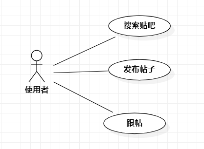

# 实验二：用例建模

## 1. 实验目标

- 确定实验题目
- 细化题目内容
- 学习画用例图

## 2. 实验内容

- 创建用例图
- 编写用例规约
- 编写实验文档

## 3. 实验步骤

- 提交"鱼肚贴吧"选题Issue
- 新建UML图并确定关系
- 编写用例规约

## 4. 实验结果

  
图1.鱼肚贴吧平台用例图

## 表1：搜索贴吧用例规约  

用例编号  | UC01 | 备注  
-|:-|-  
用例名称  | 搜索贴吧  |   
前置条件  |      | *可选*   
后置条件  |      | *可选*   
基本流程  | 1. 用户点击搜索框；  |*用例执行成功的步骤*    
~| 2. 用户输入搜索贴吧的名称；  |   
~| 3. 系统检测搜索框是否为空； |  
~| 4. 查询贴吧名；  |
~| 5. 系统显示所有具有搜索内容中文字的贴吧；  |
扩展流程  | 3.1 系统检测搜索内容为空 ，提示“搜索内容为空”|    
~| 4.1 系统查询不到有相关字的贴吧，提示“没有找到相关贴吧”  |  

## 表2：发布帖子用例规约

用例编号  | UC02 | 备注  
-|:-|-  
用例名称  | 发布帖子  |   
前置条件  | 用户进入了一个主题贴吧     | *可选*   
后置条件  |      | *可选*   
基本流程  | 1. 用户点击发帖；  |*用例执行成功的步骤* 
~| 2.系统弹出主题帖编辑页面；|   
~| 3.用户点击主题帖文本框 ；|   
~| 4.用户输入主题帖内容；|
~| 5.用户点击确认发送；  |   
~| 6.  系统检测主题帖内容是否为空；  |
~| 7. 系统上传帖子到服务器端 ；|
~| 8. 系统加入新发布的帖子到贴吧中；|   
~| 9.系统显示“发送成功” |
扩展流程  |  5.1 系统检测帖子为空，提示“帖子为空，请输入内容”  | 
~|7.1 网络不好上传失败时，提示“与服务器连接失败，请检查您的网络” |   

## 表3：跟帖规约  

用例编号  | UC03 | 备注  
-|:-|-  
用例名称  | 发送弹幕  |   
前置条件  |用户点进了贴吧中的帖子     | *可选*   
后置条件  |      | *可选*   
基本流程  | 1. 用户点击跟帖文本编辑框；  |*用例执行成功的步骤*    
~| 2. 用户输入跟帖内容； |   
~| 3. 用户点击跟帖 |
~| 4. 系统检测跟帖内容不为空；  | 
~| 5. 系统上传跟帖内容到服务器；  |  
~| 6. 系统在帖子中添加新的楼层显示跟帖；  |  
~| 7. 系统显示“跟帖成功”；  |  
扩展流程  | 4.1 系统检测跟帖内容为空时，提示“请输入内容后再进行跟帖”； |  
